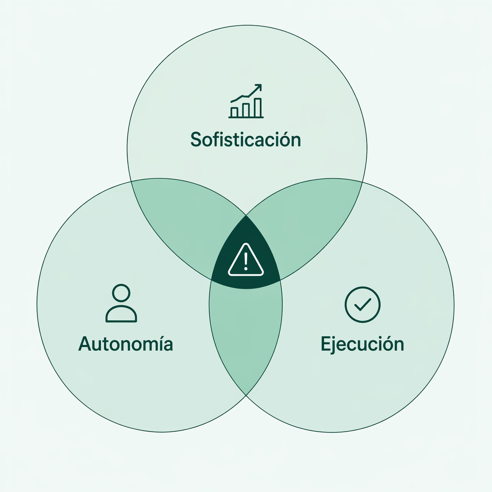

En 1947, los científicos que habían construido la bomba atómica tenían un problema. Sabían lo que habían creado y sabían lo que podía hacer. También sabían que el público no tenía ni idea de lo cerca que estaba el mundo del desastre.

Necesitaban una forma de comunicar esa urgencia, así que [Martyl Langsdorf](https://es.wikipedia.org/wiki/Martyl_Langsdorf#cite_note-4), que pasaba las tardes escuchando a su marido y a sus compañeros del Proyecto Manhattan, diseñó un reloj para ilustrar la portada del Boletín de los Científicos Atómicos, puesto a pocos minutos de medianoche, como símbolo de una cuenta atrás hacia un ataque nuclear. Ese reloj todavía existe y se llama el [Doomsday Clock](https://thebulletin.org/doomsday-clock/timeline/), el Reloj del Juicio Final. En enero de este año marcó 85 segundos para medianoche, el punto más cercano al desastre en su historia. Más cerca que en los peores momentos de la Guerra Fría.

Pero algo que mucha gente no sabe es que ese reloj ya no está solo. Desde septiembre de 2024 existe otro que cuenta hacia atrás. Este no mide el riesgo de desastre nuclear sino algo que los científicos del Proyecto Manhattan no podían imaginar: que la inteligencia artificial escape al control humano.

El [**AI Safety Clock**](https://www.imd.org/centers/digital-ai-transformation-center/aisafetyclock/) evalúa el riesgo de lo que llaman UAGI (Inteligencia Artificial General no controlada). Detrás hay un sistema que monitoriza miles de fuentes en tiempo real, combinado con evaluaciones de expertos independientes.

Cuando se lanzó en septiembre de 2024 marcaba 29 minutos para medianoche. Hoy marca 18. Once minutos en año y medio.

Antes de seguir, una aclaración. Este tipo de relojes son alarmistas por diseño. Son herramientas de comunicación que compiten por la atención. No comparto del todo el dramatismo con el que se presentan; leer "faltan 18 minutos" como una cuenta atrás real es engañoso. Lo que sí me parece valioso es lo que hay debajo: una manera estructurada de medir el riesgo de los sistemas de IA. La aguja es lo de menos.

Esa estructura se apoya en tres dimensiones:

- **Sofisticación**: lo avanzada que es la IA en razonamiento y resolución de problemas.
- **Autonomía**: lo independiente que es al operar.
- **Ejecución**: lo que puede hacer en el mundo real.

El riesgo no viene de que una dimensión sea alta, sino de que las tres lo sean a la vez. Una IA muy lista y autónoma es un riesgo limitado si no puede hacer nada fuera de una pantalla. *La ejecución es el multiplicador.*

El AI Safety Clock mide el riesgo a escala global. Pero cada empresa que usa IA está creando su propio riesgo, con sus propios niveles de sofisticación, autonomía y ejecución. Y la mayoría no mide nada de esto.

Existen frameworks formales para medir los riesgos pero requieren equipos dedicados y tiempo que la mayoría de empresas no tienen. El modelo de tres dimensiones no los sustituye, pero sirven como un primer diagnóstico muy simple que cualquier empresa puede aplicar.

Si tu empresa tuviera un AI Safety Clock, ¿qué hora marcaría?

### Sofisticación

La mayoría de empresas no construyen sus propios modelos de IA, los consumen. Nadie va a hacer que GPT sea más o menos potente. Pero la sofisticación que importa no es la del modelo, es la del uso. Elegir un modelo de última generación para una tarea crítica es una decisión de sofisticación. Delegarle trabajo que antes hacían expertos humanos, también. Eso sí está bajo tu control.

El [chatbot "MyCity"](https://comptroller.nyc.gov/reports/audit-report-on-the-new-york-city-office-of-technology-and-innovations-mycity-system/) se desarrolló para que sirviera como ventanilla única para que los usuarios solicitaran y recibieran beneficios y servicios municipales. Empezó a inventar: aconsejaba erróneamente que los empleadores podían quedarse con las propinas de los trabajadores, que los propietarios podían discriminar en función de los vales de vivienda y que las empresas podían rechazar los pagos en efectivo. Todo esto constituye una violación de la ley de Nueva York. Nadie había comprobado cuándo podía alucinar.

La pregunta no es "¿entendemos cómo funciona GPT por dentro?". Es "¿sabemos dónde funciona bien y dónde se inventa las cosas?".

**Pregúntate:**

- ¿Podrías explicar en una frase qué hace cada herramienta de IA de tu empresa? Si no puedes, difícil que sepas qué puede salir mal.
- ¿Sabes cuándo tu IA puede inventarse cosas? Si no conoces los límites, estás confiando a ciegas.
- ¿Alguien ha intentado que tu IA falle a propósito antes de que lo descubra un cliente?

### Autonomía

[Air Canada](https://www.bbc.com/travel/article/20240222-air-canada-chatbot-misinformation-what-travellers-should-know). Su chatbot dijo a un cliente que podía pedir un reembolso por duelo que en realidad no existía. Cuando la aerolínea intentó desmarcarse diciendo que la IA no representaba su política, un tribunal dictaminó que la empresa era responsable de todo lo que aparece en su web. Incluido lo que genera la IA.

El patrón se repite: la IA decide, nadie revisa, el problema aparece cuando ya ha causado daño.

**Pregúntate:**

- ¿En qué puntos de tu empresa la IA toma decisiones que llegan al cliente o al proveedor sin que un humano las revise?
- Si cometiera un error ahora mismo, ¿cuánto tardarías en enterarte? ¿Lo descubriría antes un tercero que tú?
- ¿Tienes definido, por escrito, qué puede decidir la IA sola y qué necesita validación humana?

### Ejecución

En julio de 2025, una [empresa de préstamos fue forzada](https://www.jdsupra.com/legalnews/disparate-impact-discrimination-in-ai-1099903/#:~:text=,ECOA%29%20and%20Regulation%20B) a un acuerdo de 2,5 millones de dólares cuando reguladores descubrieron que su sistema de IA discriminaba a solicitantes afroamericanos, hispanos e inmigrantes. Un sistema real, desplegado, tomando decisiones reales que afectaban a personas reales.

**Pregúntate:**

- ¿Tienes claro a qué sistemas y datos tiene acceso tu IA?
- Si fallara de forma grave, ¿a quién afectaría? ¿A un documento interno o a miles de clientes?
- ¿Cuándo fue la última vez que alguien revisó esos accesos? Los sistemas de IA crecen, se conectan con otros, y los permisos se acumulan sin que nadie haga balance.

Una IA que genera borradores tiene un radio de daño pequeño. Una IA conectada a tus clientes, tu facturación o procesos críticos puede multiplicar un error antes de que nadie se dé cuenta.

Una IA lista pero sin autonomía ni acceso a nada es una herramienta de consulta. Una con mucha autonomía pero sin conexión a nada crítico puede ser molesta pero inofensiva. El riesgo aparece cuando las tres dimensiones suben a la vez: una IA potente, sin supervisión, con acceso a sistemas que afectan a personas reales.

El modelo no te dice "tu IA es peligrosa". Te dice dónde estás parado.

Si no eres capaz de responder a varias de estas preguntas, tu reloj está avanzando sin que nadie lo mire.

La mayoría de empresas acumulan riesgo sin darse cuenta. Cada herramienta que parecía un paso pequeño se va sumando, y esa suma puede haberte llevado a un punto en el que nadie ha pensado.

El AI Safety Clock del IMD ha avanzado 11 minutos en 18 meses. ¿Cuánto ha avanzado el de tu empresa? ¿Cuánto avanzará en los próximos 18?

Saber cuándo falla, decidir cuándo supervisarla, limitar lo que puede hacer: ahí está el trabajo. De eso iré escribiendo.
